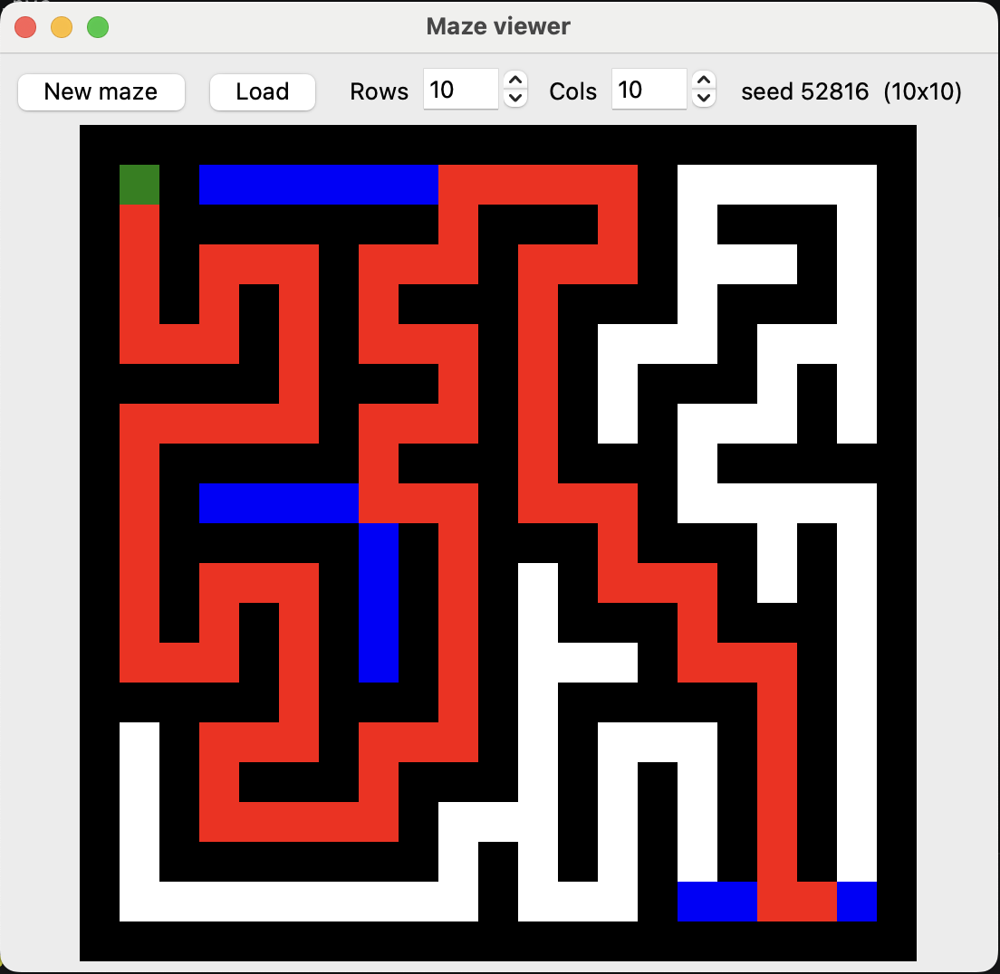

# Maze Generator and Solver

A project for my C programming class.

We built a program that generates a random maze, solves it, and shows it
in a small GUI. The maze is generated in C, solved in C (using BFS), and
a Python (tkinter) window animates the solving.

## Who did what

- **Me:** the solver (`maze_solve.c`) and the GUI (`maze_gui.py`)
- **My friend:** the maze generation (`maze_generate.c`)

## What it looks like



## How to run

Build the C program:

```
cc main.c maze_generate.c maze_solve.c -o maze
```

Then open the GUI:

```
python3 maze_gui.py
```

